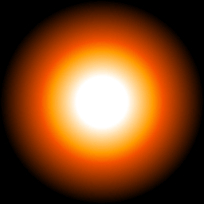

# create-graphic

A simple function for drawing on a canvas element and receiving the result. Useful for programmatically-generated static graphics, WebGL textures (think particles) etc.

## Install

```bash
npm install create-graphic
```

## Use

```js
import createGraphic from 'create-graphic';

const graphic = createGraphic(256, (context, width, height) => {
  const radius = width / 2;
  const gradient = context.createRadialGradient(radius, radius, 0, radius, radius, radius);
  gradient.addColorStop(0, 'rgba(255, 255, 255, 1)');
  gradient.addColorStop(0.25, 'rgba(255, 255, 255, 1)');
  gradient.addColorStop(0.5, 'rgba(255, 156, 1, 1)');
  gradient.addColorStop(0.6, 'rgba(243, 81, 1, 1)');
  gradient.addColorStop(1, 'rgba(0, 0, 0, 1)');
  context.fillStyle = gradient;
  context.fillRect(0, 0, width, width);
});
```



The `draw` function will return the canvas context by default, but you can return anything to override this. The example below also demonstrates defining both width and height, and using the draw function context as the, um, `context` when not using an arrow function.

```js
import createGraphic from 'create-graphic';

const graphic = createGraphic([400, 200], function(context, width, height) {
  this.fillStyle = '#C0FFEE';
  this.fillRect(0, 0, width, height);
  return this.canvas.toDataURL();
});
```
